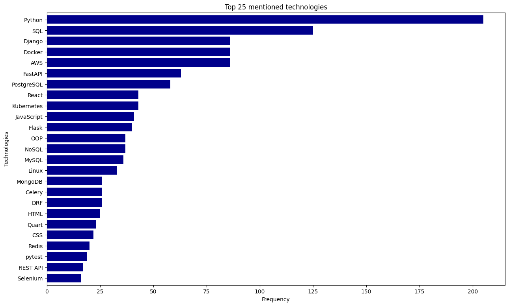

# 📈  Djinny vacancy scraping
Django project for managing newspapers and redactors.

## 🛠️ Installation

1. Clone the repository:
   ```bash
   git clone https://github.com/9rosLove/vacancy-scraping.git
   cd vacancy-scrapping
   ```
2. Set up a virtual environment and activate it:
   - For Windows 🪟:
   
    ```shell
    python3 -m venv venv
    source venv/bin/activate
    ```
   
     - For Linux 🐧:
    ```bash
    python3 -m venv venv
    source venv/bin/activate
    ```

3. Install the required dependencies:
    ```bash
    pip install -r requirements.txt   
    ```
## 🕵️‍♀️ Run scrapy
   ```shell
   scrapy crawl vacancies -O vacancies.csv
   ```
## 🚀Utilize Jupyter Notebook for Data Analysis:
   ```shell
    jupyter-notebook main.pynb
   ```

## 📊 Demo

